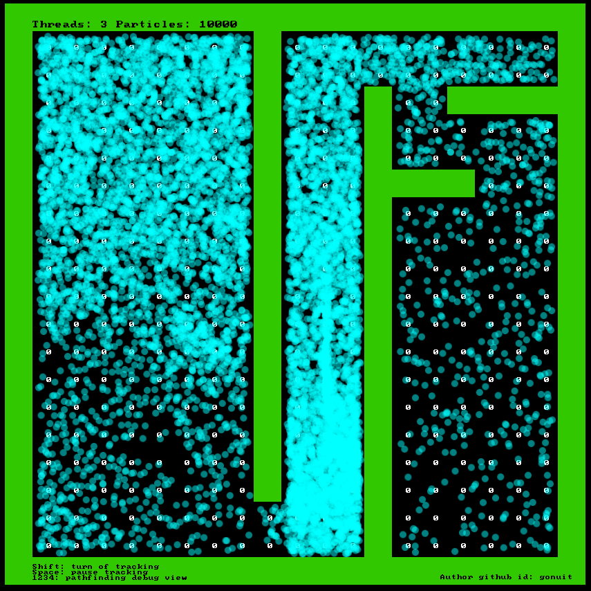

# Goal-Based Vector Field Pathfinding

## [Working Example](http://vector-pathfinding.klyta.it/) 




- [Goal-Based Vector Field Pathfinding](#goal-based-vector-field-pathfinding)
  - [Working Example](#working-example)
- [1. Setup](#1-setup)
  - [1.1. Download packages](#11-download-packages)
  - [1.2. Run project](#12-run-project)
    - [1.2.1 Development](#121-development)
    - [1.2.2 Production](#122-production)
- [2. About](#2-about)
  - [2.1 Technologies](#21-technologies)

# 1. Setup

## 1.1. Download packages
```
yarn
```
or
```
npm install
```
## 1.2. Run project
### 1.2.1 Development
```
yarn dev
```
or
```
npm run dev
```
### 1.2.2 Production
```
yarn build
```
or
```
npm run build
```

# 2. About
## 2.1 Technologies
- TypeScript
- Web workers (multi threading)
- PIXI.JS (faster rendering of particles than in Phaser.js - Phaser.js also uses the PIXI.JS framework, but an older, heavily modified version) (WebGL)