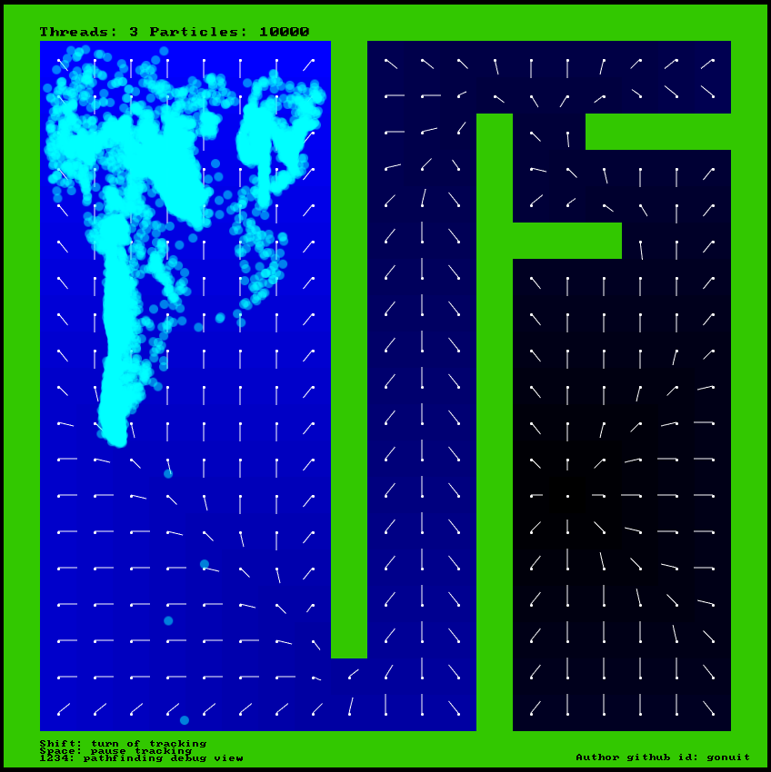

# Goal-Based Vector Field Pathfinding



- [Goal-Based Vector Field Pathfinding](#Goal-Based-Vector-Field-Pathfinding)
- [1. Setup](#1-Setup)
  - [1.1. Download packages](#11-Download-packages)
  - [1.2. Run project](#12-Run-project)
    - [1.2.1 Development](#121-Development)
    - [1.2.2 Production](#122-Production)
- [2. About](#2-About)
  - [2.1 Technologies](#21-Technologies)

# 1. Setup

## 1.1. Download packages
```
yarn
```
or
```
npm install
```
## 1.2. Run project
### 1.2.1 Development
```
yarn dev
```
or
```
npm run dev
```
### 1.2.2 Production
```
yarn build
```
or
```
npm run build
```

# 2. About
## 2.1 Technologies
- TypeScript
- Web workers (multi threading)
- PIXI.JS (faster rendering of particles than in Phaser.js - Phaser.js also uses the PIXI.JS framework, but an older, heavily modified version) (WebGL)